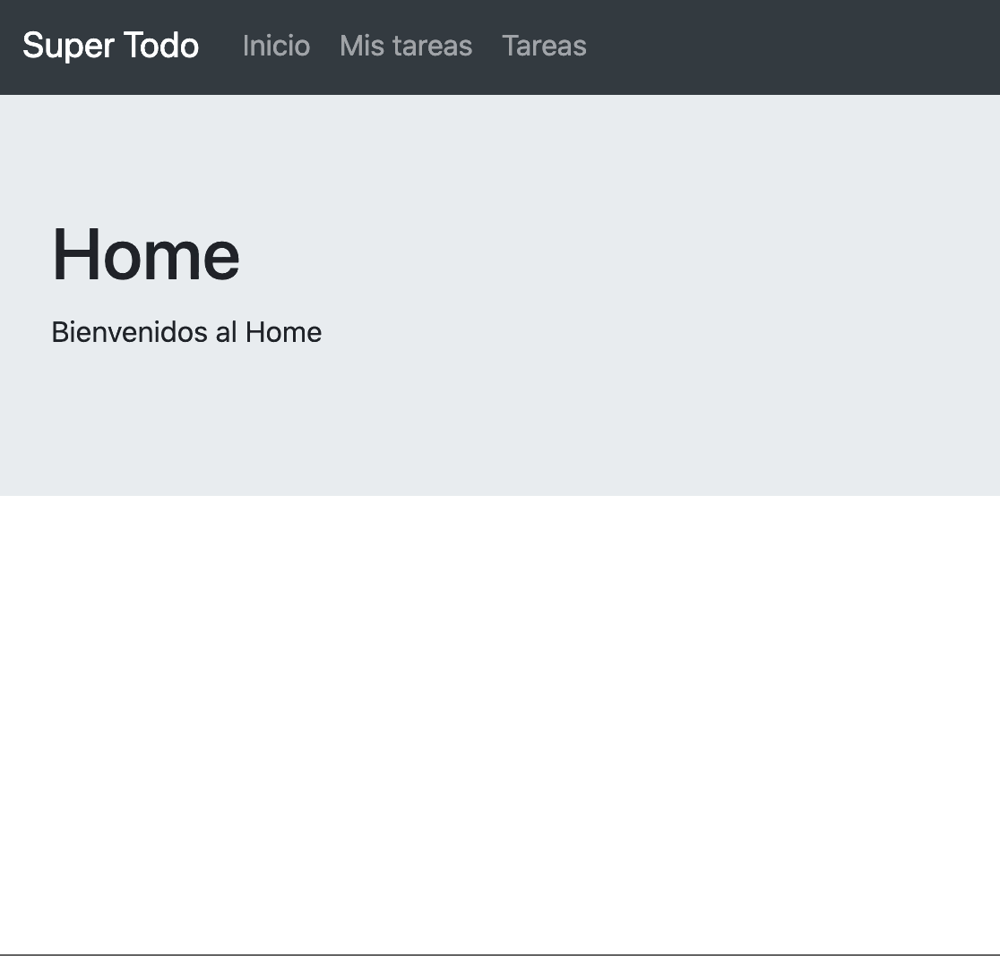

<p>
    <h2 align="center"> Ejercicio super-todo </h2>
</p>

En este ejercicio realizamos un ejemplo utilizando:
- [React-router](https://reactrouter.com/)

- [Context API](https://es.reactjs.org/docs/context.html)


<h2>Instalación:</h2>

1. Asegurate de tener [nodejs](https://nodejs.org/es/) instalado

2. En tu terminal clonar el proyecto con el comando 

```
git clone https://github.com/mortegac/sodimac-to-do-list-router.git
```

3.- Una vez descargado a tu computador, ingresar en la carpeta del proyecto
```
cd sodimac-to-do-list-router

```
4.- Instalar las dependencia del proyecto utilizando:

```
yarn install
```

5.- Ejecutar el proyecto en modo de desarrollo

```
yarn start
```

<p align="center">
  
</p>


